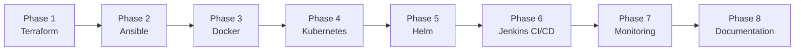

# 🛠 DevOps Platform — Implementation Plan

## Overview

This document defines the **phased build plan** for a production-grade DevOps platform on AWS, covering infrastructure provisioning, configuration management, containerization, orchestration, CI/CD, and observability.

Each phase produces a **testable, working layer** before the next phase begins — matching real-world DevOps practice where every layer must be verified in isolation.

> **Estimated total scope:** 8,000–15,000 lines across Terraform, Ansible, Docker, Kubernetes, Helm, Jenkins, and monitoring configuration.

### Build Sequence



> **Why this order?** Each later phase depends on infrastructure or tooling from an earlier one (e.g., Phase 4 needs the EKS cluster from Phase 1; Phase 6 needs the Helm chart from Phase 5). This eliminates rework.

---

## Target Repository Structure

```
nti-devops-final-project/
├── Terraform/              Phase 1 — AWS infrastructure (VPC, EKS, RDS, IAM…)
├── ansible/                Phase 2 — Jenkins host configuration
├── docker/                 Phase 3 — Application container stack
├── k8s/                    Phase 4 — Kubernetes manifests
├── helm/                   Phase 5 — Helm chart + cluster add-ons
├── jenkins/                Phase 6 — CI/CD pipeline
├── monitoring/             Phase 7 — Prometheus stack
├── docs/                   Phase 8 — Documentation
└── README.md
```

---

## Phase 1 — Terraform (AWS Infrastructure)

> **🎯 Goal:** Provision the complete AWS foundation that everything else runs on.

### Directory Structure

```
Terraform/
├── backend.tf          # S3 + DynamoDB remote state
├── provider.tf         # AWS provider configuration
├── variables.tf        # All input variables
├── outputs.tf          # Exported values (IPs, endpoints, ARNs)
├── terraform.tfvars    # Variable values
├── main.tf             # Root module — wires all child modules
├── mnt/user-data/      # EC2 user-data scripts
└── modules/
    ├── vpc/              # VPC, subnets, IGW, NAT, route tables
    ├── security-groups/  # SGs for Jenkins, EKS, RDS, ALB
    ├── iam/              # IAM roles & instance profiles
    ├── eks/              # EKS cluster + managed node group
    ├── ecr/              # ECR container registry
    ├── rds/              # PostgreSQL 16 RDS instance
    ├── secrets-manager/  # DB credentials storage
    ├── ec2-jenkins/      # Jenkins EC2 + Elastic IP
    ├── backup/           # AWS Backup vault & plan
    ├── s3/               # General-purpose S3 bucket
    └── alb-logs/         # S3 bucket for ALB access logs
```

### Resources Delivered

| Resource | Details |
|---|---|
| VPC | `10.0.0.0/16` with DNS hostnames enabled |
| Subnets | 2 public (`10.0.0.0/24`, `10.0.1.0/24`) + 2 private (`10.0.10.0/24`, `10.0.11.0/24`) |
| Gateways | Internet Gateway + NAT Gateway |
| Route Tables | Public (→ IGW) + Private (→ NAT) |
| Security Groups | Jenkins, EKS cluster/nodes, RDS, ALB |
| IAM Roles | EKS cluster role, node group role, Jenkins EC2 role, CloudWatch role |
| EKS Cluster | Kubernetes 1.34 with managed node group (2–4 `t3.medium` nodes) |
| Jenkins EC2 | `t3.large` in public subnet with Elastic IP |
| RDS | PostgreSQL 16, private subnet, encrypted at rest |
| Secrets Manager | `db-credentials` and `rds-endpoint` secrets |
| ECR | Container image registry with scan-on-push |
| AWS Backup | Daily snapshots, 35-day retention (Jenkins EC2) |
| S3 | ALB access logs bucket with lifecycle policy |

### Sub-Part Breakdown

Given the size of Phase 1, it is broken into **7 independently deployable sub-parts**:

| Part | Scope | Key Terraform Resources |
|------|-------|------------------------|
| **1** | Project scaffold, provider, backend, VPC | `aws_vpc`, `aws_subnet`, `aws_route_table`, `aws_nat_gateway`, `aws_internet_gateway` |
| **2** | Security groups | `aws_security_group`, `aws_security_group_rule` |
| **3** | IAM roles & policies | `aws_iam_role`, `aws_iam_policy`, `aws_iam_instance_profile` |
| **4** | EKS cluster + node group | `aws_eks_cluster`, `aws_eks_node_group` (2 nodes, autoscaling 2→4) |
| **5** | Jenkins EC2 instance | `aws_instance`, `aws_eip`, `aws_eip_association` |
| **6** | RDS + Secrets Manager | `aws_db_instance`, `aws_db_subnet_group`, `aws_secretsmanager_secret` |
| **7** | ECR, S3, Backup, root integration | `aws_ecr_repository`, `aws_s3_bucket`, `aws_backup_vault`, outputs |

### ✅ Exit Criteria

- `terraform plan` shows no errors
- `terraform apply` succeeds end-to-end
- VPC, subnets, and route tables are verified in AWS Console
- EKS cluster reports `ACTIVE`; `kubectl get nodes` shows 2 Ready nodes
- Jenkins EC2 is reachable via its Elastic IP
- RDS endpoint is resolvable from private subnets
- Secrets Manager contains the generated credentials

---

## Phase 2 — Ansible (Configuration Management)

> **🎯 Goal:** Fully configure the Jenkins EC2 host with all required tooling via automated, idempotent playbooks.

### Directory Structure

```
ansible/
├── ansible.cfg                 # Ansible configuration
├── requirements.yml            # Galaxy dependencies
├── inventory/
│   └── hosts.ini               # Jenkins host (auto-populated)
├── group_vars/
│   └── all.yml                 # Shared variables
├── playbooks/
│   ├── site.yml                # Main playbook — runs all roles
│   └── verify.yml              # Post-install verification
├── roles/
│   ├── docker/                 # Docker CE installation
│   ├── java/                   # JDK 17
│   ├── git/                    # Git
│   ├── jenkins/                # Jenkins LTS + plugin installation
│   ├── awscli/                 # AWS CLI v2
│   ├── kubectl/                # kubectl binary
│   ├── helm/                   # Helm 3
│   └── cloudwatch/             # CloudWatch Agent
└── scripts/
    └── update-inventory.sh     # Reads Jenkins IP from Terraform output
```

### Automation Scope

| Role | What It Installs / Configures |
|---|---|
| `docker` | Docker CE, adds `jenkins` user to `docker` group |
| `java` | JDK 17 (Jenkins prerequisite) |
| `git` | Git (for SCM checkout) |
| `jenkins` | Jenkins LTS, initial admin setup, plugin installation (Git, Docker, Pipeline, Blue Ocean, SonarQube, AWS, Kubernetes, Credentials, Multibranch, ECR, AnsiColor) |
| `awscli` | AWS CLI v2 (ECR login, EKS kubeconfig) |
| `kubectl` | kubectl binary matching EKS version |
| `helm` | Helm 3 (chart deployments) |
| `cloudwatch` | CloudWatch Agent for EC2 metrics & logs |

### ✅ Exit Criteria

- `ansible-playbook playbooks/site.yml` completes idempotently (0 changed on second run)
- Jenkins UI is accessible at `http://<jenkins-ip>:8080`
- All required plugins are installed and active
- `docker`, `aws`, `kubectl`, and `helm` commands work on the Jenkins host
- CloudWatch Agent is sending metrics to AWS CloudWatch

---

## Phase 3 — Docker (Application Containerization)

> **🎯 Goal:** Containerize the Django application with a production-ready multi-service stack that runs locally.

### Directory Structure

```
docker/
├── Dockerfile              # Multi-stage build (builder + production)
├── docker-compose.yml      # Full local stack
├── entrypoint.sh           # Startup script (wait for DB, run migrations)
├── requirements.txt        # Python dependencies
├── .env.example            # Environment variable template
├── .gitignore              # Ignore .env, __pycache__, etc.
└── nginx/
    └── nginx.conf          # Reverse proxy: Nginx → Gunicorn
```

### Application Stack

| Service | Image | Port | Purpose |
|---|---|---|---|
| **app** | Custom Django | 8000 (internal) | Gunicorn WSGI server |
| **db** | PostgreSQL 16 | 5432 | Relational database |
| **redis** | Redis 7 | 6379 | Cache / message broker |
| **nginx** | Nginx 1.27 | 80 | Reverse proxy + static files |

### Dockerfile Highlights

- **Multi-stage build** — separate builder and production stages
- **Non-root user** — runs as `appuser` (UID 1000)
- **Health check** included
- **Minimal final image** — only runtime dependencies

### ✅ Exit Criteria

- `docker compose up --build` brings all 4 services to healthy state
- Application responds at `http://localhost`
- Django admin is accessible at `http://localhost/admin/`
- Database migrations run automatically via `entrypoint.sh`

---

## Phase 4 — Kubernetes (Manifests)

> **🎯 Goal:** Create production-quality Kubernetes manifests that deploy the application to the EKS cluster.

### Manifests

| File | Resource | Description |
|---|---|---|
| `namespace.yaml` | Namespace | `nti-devops` namespace with labels |
| `deployment.yaml` | Deployment | 2 replicas, resource limits, probes, security context |
| `service.yaml` | Service | ClusterIP exposing port 80 → 8000 |
| `ingress.yaml` | Ingress | AWS ALB via Load Balancer Controller annotations |
| `configmap.yaml` | ConfigMap | Application configuration (non-secret) |
| `secret.yaml` | Secret | Database credentials (base64-encoded) |
| `networkpolicy.yaml` | NetworkPolicy | Default-deny + granular allow rules |
| `horizontalpodautoscaler.yaml` | HPA | Scale 2→6 replicas on CPU/memory |

### Security Controls

- **Non-root containers**: `runAsUser: 1000`, `runAsNonRoot: true`
- **Read-only filesystem**: `readOnlyRootFilesystem: true`
- **Capability drops**: `ALL` capabilities dropped
- **Network isolation**: Default-deny ingress/egress with explicit allow rules

### ✅ Exit Criteria

- All manifests apply cleanly: `kubectl apply -f k8s/`
- Pods reach `Running` / `Ready` state
- Service is reachable internally via ClusterIP
- ALB is provisioned and the app is reachable via the ALB DNS name
- HPA shows current/desired replicas
- NetworkPolicy restricts traffic as expected

---

## Phase 5 — Helm (Packaging)

> **🎯 Goal:** Templatize the Phase 4 manifests into a reusable Helm chart for parameterized, repeatable deployments.

### Chart Structure

```
helm/
├── myapp/
│   ├── Chart.yaml              # Chart metadata (name, version, appVersion)
│   ├── values.yaml             # Default values
│   └── templates/              # Templated K8s manifests
│       ├── _helpers.tpl        # Template helpers
│       ├── namespace.yaml
│       ├── deployment.yaml
│       ├── service.yaml
│       ├── ingress.yaml
│       ├── configmap.yaml
│       ├── secret.yaml
│       ├── networkpolicy.yaml
│       └── hpa.yaml
├── releases/
│   ├── metrics-server-values.yaml                   # Metrics Server values
│   └── aws-load-balancer-controller-values.yaml     # AWS LBC values
├── irsa/
│   └── lbc-irsa.tf            # IRSA Terraform for Load Balancer Controller
└── values-production.yaml     # Production environment overrides
```

### Key Parameterized Values

- Image repository and tag
- Replica count (min/max)
- Resource requests/limits
- Ingress hostname and annotations
- Database connection parameters
- Environment-specific configuration

### ✅ Exit Criteria

- `helm lint ./helm/myapp` passes
- `helm template ./helm/myapp` renders valid manifests
- `helm install myapp ./helm/myapp -n nti-devops` succeeds on EKS
- `helm upgrade` performs a rolling update with zero downtime

---

## Phase 6 — Jenkins (CI/CD Pipeline)

> **🎯 Goal:** Implement a production-grade Jenkins multibranch pipeline with automated quality gates, security scanning, and deployment.

### Pipeline Stages

```
┌──────────┐   ┌────────────┐   ┌───────────┐   ┌───────────────┐
│ Checkout  │──▶│ Unit Tests │──▶│ SonarQube │──▶│ Quality Gate  │
└──────────┘   └────────────┘   └───────────┘   └───────┬───────┘
                                                         │ PASS
┌──────────────┐   ┌────────────┐   ┌──────────┐  ┌────▼────────┐
│ Helm Deploy  │◀──│ Push → ECR │◀──│ Trivy    │◀─│ Docker      │
│ (main only)  │   │            │   │ Scan     │  │ Build       │
└──────┬───────┘   └────────────┘   └──────────┘  └─────────────┘
       ▼
┌──────────────┐
│ Verify       │
└──────────────┘
```

### Stage Details

| Stage | Description | Failure Behavior |
|---|---|---|
| **Checkout** | Clone repository from GitHub | Pipeline fails |
| **Unit Tests** | Run Django test suite | Pipeline fails |
| **SonarQube** | Static code analysis via `sonar-scanner` | Pipeline fails |
| **Quality Gate** | `waitForQualityGate()` — checks SonarQube thresholds | Pipeline **stops** if gate fails |
| **Docker Build** | `docker build` from `docker/Dockerfile` | Pipeline fails |
| **Trivy Scan** | `trivy image` — scans for vulnerabilities | Pipeline **fails** on HIGH/CRITICAL |
| **Push to ECR** | `aws ecr get-login-password` → `docker push` | Pipeline fails |
| **Helm Deploy** | `helm upgrade --install` on EKS (main branch only) | Pipeline fails |
| **Verify** | Post-deployment health checks | Pipeline reports warning |

### Pipeline Files

| File | Purpose |
|---|---|
| `Jenkinsfile` | Declarative pipeline definition |
| `sonar-project.properties` | SonarQube scanner configuration |
| `trivy.yaml` | Trivy scan severity thresholds |
| `.trivyignore` | Known/accepted vulnerability exceptions |
| `docker-compose.test.yml` | Test stack for CI environment |

### ✅ Exit Criteria

- GitHub push triggers the pipeline via webhook
- All stages execute successfully for a clean commit
- Quality Gate blocks a deliberately failing commit
- Trivy blocks an image with a known HIGH CVE
- `main` branch pushes result in a deployed, verified release on EKS

---

## Phase 7 — Monitoring (Observability)

> **🎯 Goal:** Deploy a full observability stack with pre-configured dashboards and alert rules.

### Components Deployed

| Component | Version | Purpose |
|---|---|---|
| Prometheus | (via kube-prometheus-stack 87.10.1) | Metrics collection |
| Grafana | 10.x | Dashboard visualization |
| Alertmanager | 0.33.1 | Alert routing and notification |
| Node Exporter | (bundled) | Host-level metrics |
| kube-state-metrics | (bundled) | Kubernetes object metrics |

### Custom Deliverables

| Deliverable | File | Description |
|---|---|---|
| **10 Alert Rules** | `alerts/nti-devops-rules.yaml` | Custom PrometheusRule covering availability, resources, nodes, Redis, storage |
| **ServiceMonitor** | `alerts/servicemonitor.yaml` | Auto-discovers and scrapes application metrics |
| **Grafana Dashboard** | `dashboards/nti-devops-application.json` | Application health dashboard (RED metrics, resources, Redis, DB) |
| **Install Script** | `install/install.sh` | One-command installer for the full stack |

### Alert Categories

| Category | Example Alerts |
|---|---|
| **Availability** | Pod crash loops, high restart count, replica mismatch |
| **Resources** | CPU > 80%, memory > 80% |
| **Nodes** | Node not ready, disk pressure |
| **Redis** | Connection failures |
| **Storage** | PVC nearing capacity |
| **Application** | High 5xx error rate |

### ✅ Exit Criteria

- All monitoring pods are `Running` in the `monitoring` namespace
- Prometheus is scraping cluster and application metrics (verify via Prometheus UI targets page)
- Grafana dashboard shows live data
- A deliberately triggered condition (e.g., scaling to 0 replicas) fires an alert through Alertmanager

---

## Phase 8 — Documentation

> **🎯 Goal:** Produce documentation complete enough that a new team member can deploy and operate the platform from scratch.

### Documentation Deliverables

| Document | Purpose |
|---|---|
| `README.md` | Project overview, architecture, quick start, tech stack |
| `docs/architecture.svg` | Architecture diagram |
| `docs/deployment-guide.md` | Step-by-step deployment from zero to running |
| `docs/troubleshooting-guide.md` | Common failure modes, root causes, and fixes |
| `Project-implementation-plan.md` | This document — phased build plan |

### ✅ Exit Criteria

- A new team member can follow the documentation alone to:
  1. Provision infrastructure
  2. Deploy the application
  3. Access monitoring dashboards
  4. Diagnose and fix a common failure

---

## Summary

| Phase | Component | Key Deliverable | Depends On |
|---|---|---|---|
| **1** | Terraform | AWS infrastructure (VPC, EKS, RDS, Jenkins EC2) | — |
| **2** | Ansible | Configured Jenkins host with all tooling | Phase 1 |
| **3** | Docker | Containerized Django app running locally | — |
| **4** | Kubernetes | K8s manifests deployed to EKS | Phase 1 |
| **5** | Helm | Templatized, parameterized chart | Phase 4 |
| **6** | Jenkins | Automated CI/CD pipeline | Phases 1, 2, 3, 5 |
| **7** | Monitoring | Prometheus + Grafana + alerts | Phase 1, 4 |
| **8** | Documentation | Complete operations documentation | All phases |
