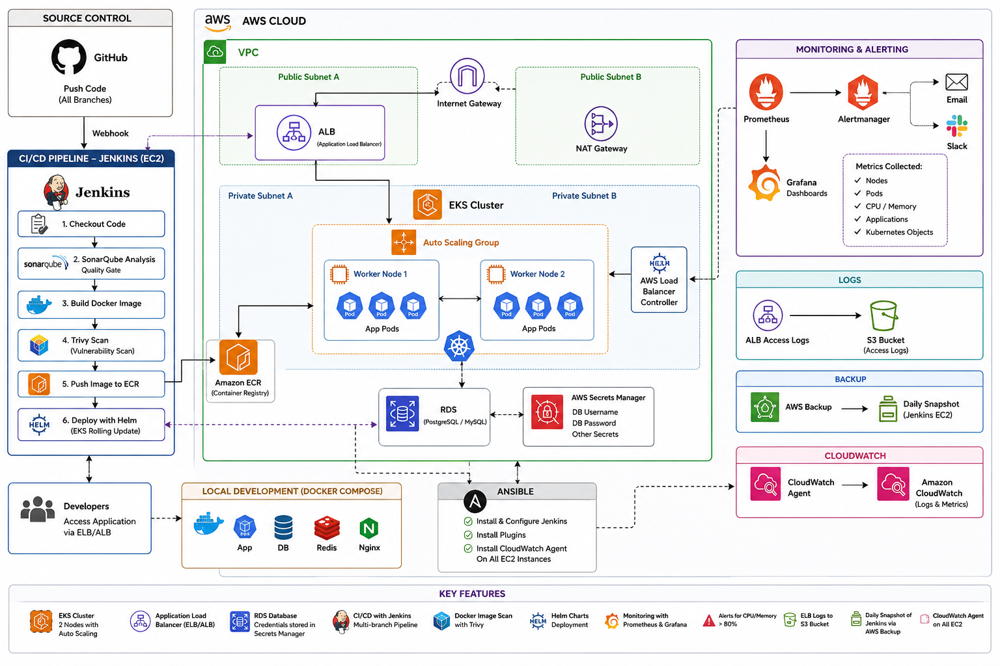

<h1 align="center">🚀 NTI DevOps Final Project</h1>

<p align="center">
  <strong>A production-grade, end-to-end DevOps platform on AWS</strong>
</p>

<p align="center">
  
  
  
  
  
  
  
  
</p>

<p align="center">
  
  
  
  
  
  
  
  
</p>

---

## 📋 Table of Contents

- [Overview](#-overview)
- [Architecture](#-architecture)
- [Repository Structure](#-repository-structure)
- [Technology Stack](#-technology-stack)
- [Prerequisites](#-prerequisites)
- [Quick Start](#-quick-start)
- [CI/CD Pipeline](#-cicd-pipeline)
- [Monitoring & Alerting](#-monitoring--alerting)
- [Security](#-security)
- [Documentation](#-documentation)
- [Contributing](#-contributing)
- [License](#-license)

---

## 🎯 Overview

This project delivers a **complete, production-ready DevOps platform** built entirely on AWS. It was developed as the final project for the **NTI DevOps Program** and demonstrates mastery of the full DevOps lifecycle:

| Capability | Implementation |
|---|---|
| **Infrastructure as Code** | Terraform modules for VPC, EKS, RDS, IAM, ECR, Backup, and more |
| **Configuration Management** | Ansible roles for Jenkins host automation |
| **Containerization** | Multi-stage Docker builds with Nginx reverse proxy |
| **Orchestration** | Kubernetes manifests + Helm charts on EKS |
| **CI/CD** | Jenkins multibranch pipeline with quality gates |
| **Security Scanning** | SonarQube static analysis + Trivy container scanning |
| **Observability** | Prometheus, Grafana dashboards, and Alertmanager |

The platform deploys a **Django web application** backed by **PostgreSQL (RDS)** and **Redis**, served through **Gunicorn** behind an **Nginx** reverse proxy, exposed to the internet via an **AWS Application Load Balancer**.

---

## 🏗 Architecture

<p align="center">
  
</p>

### Key Design Decisions

- **Public/Private subnet split** — Jenkins sits in a public subnet (webhook ingress), while EKS nodes and RDS live in private subnets behind a NAT Gateway.
- **IRSA (IAM Roles for Service Accounts)** — The AWS Load Balancer Controller authenticates via IRSA, eliminating long-lived credentials.
- **Secrets Manager** — Database credentials are generated and rotated via AWS Secrets Manager; they are never committed to Git.
- **Horizontal Pod Autoscaler** — Application scales between 2 and 6 replicas based on CPU and memory utilization.

---

## 📁 Repository Structure

```
nti-devops-final-project/
│
├── Terraform/                          # Phase 1 — AWS Infrastructure (IaC)
│   ├── backend.tf                      #   Remote state configuration (S3 + DynamoDB)
│   ├── provider.tf                     #   AWS provider setup
│   ├── variables.tf                    #   Input variable definitions
│   ├── terraform.tfvars                #   Variable values
│   ├── outputs.tf                      #   Output values (endpoints, IDs, IPs)
│   ├── main.tf                         #   Root module — wires all child modules
│   ├── mnt/user-data/                  #   EC2 user-data scripts
│   └── modules/                        #   Reusable Terraform modules
│       ├── vpc/                        #     VPC, subnets, IGW, NAT, route tables
│       ├── security-groups/            #     Security groups (Jenkins, EKS, RDS, ALB)
│       ├── iam/                        #     IAM roles & policies
│       ├── eks/                        #     EKS cluster + managed node group
│       ├── ecr/                        #     ECR container registry
│       ├── rds/                        #     RDS PostgreSQL instance
│       ├── secrets-manager/            #     AWS Secrets Manager
│       ├── ec2-jenkins/                #     Jenkins EC2 instance + EIP
│       ├── backup/                     #     AWS Backup vault & plan
│       ├── s3/                         #     S3 bucket (general)
│       └── alb-logs/                   #     S3 bucket for ALB access logs
│
├── ansible/                            # Phase 2 — Configuration Management
│   ├── ansible.cfg                     #   Ansible configuration
│   ├── requirements.yml                #   Galaxy role dependencies
│   ├── inventory/
│   │   └── hosts.ini                   #   Inventory (Jenkins host IP)
│   ├── group_vars/
│   │   └── all.yml                     #   Shared variables
│   ├── playbooks/
│   │   ├── site.yml                    #   Main playbook — full host setup
│   │   └── verify.yml                  #   Verification playbook
│   ├── roles/
│   │   ├── docker/                     #   Install Docker CE
│   │   ├── java/                       #   Install Java (JDK 17)
│   │   ├── git/                        #   Install Git
│   │   ├── jenkins/                    #   Install & configure Jenkins + plugins
│   │   ├── awscli/                     #   Install AWS CLI v2
│   │   ├── kubectl/                    #   Install kubectl
│   │   ├── helm/                       #   Install Helm 3
│   │   └── cloudwatch/                 #   Install CloudWatch Agent
│   └── scripts/
│       └── update-inventory.sh         #   Auto-populate inventory from TF output
│
├── docker/                             # Phase 3 — Application Containerization
│   ├── Dockerfile                      #   Multi-stage Python/Django image
│   ├── docker-compose.yml              #   Local dev stack (app, db, redis, nginx)
│   ├── entrypoint.sh                   #   Container entrypoint (migrations, etc.)
│   ├── requirements.txt                #   Python dependencies
│   ├── .env.example                    #   Environment variable template
│   ├── .gitignore                      #   Docker-specific ignores
│   └── nginx/
│       └── nginx.conf                  #   Nginx reverse proxy configuration
│
├── k8s/                                # Phase 4 — Kubernetes Manifests
│   ├── namespace.yaml                  #   nti-devops namespace
│   ├── deployment.yaml                 #   Application deployment (2–6 replicas)
│   ├── service.yaml                    #   ClusterIP service
│   ├── ingress.yaml                    #   ALB Ingress (AWS LBC annotations)
│   ├── configmap.yaml                  #   Application config
│   ├── secret.yaml                     #   Kubernetes secrets
│   ├── networkpolicy.yaml              #   Default-deny + allow rules
│   └── horizontalpodautoscaler.yaml    #   HPA (CPU/memory based)
│
├── helm/                               # Phase 5 — Helm Chart & Cluster Add-ons
│   ├── myapp/                          #   Application Helm chart
│   │   ├── Chart.yaml                  #     Chart metadata
│   │   ├── values.yaml                 #     Default values
│   │   └── templates/                  #     Templated K8s manifests
│   │       ├── _helpers.tpl
│   │       ├── namespace.yaml
│   │       ├── deployment.yaml
│   │       ├── service.yaml
│   │       ├── ingress.yaml
│   │       ├── configmap.yaml
│   │       ├── secret.yaml
│   │       ├── networkpolicy.yaml
│   │       └── hpa.yaml
│   ├── releases/                       #   Cluster add-on values
│   │   ├── metrics-server-values.yaml
│   │   └── aws-load-balancer-controller-values.yaml
│   ├── irsa/
│   │   └── lbc-irsa.tf                 #   IRSA Terraform for LBC
│   └── values-production.yaml          #   Production value overrides
│
├── jenkins/                            # Phase 6 — CI/CD Pipeline
│   ├── Jenkinsfile                     #   Declarative multibranch pipeline
│   ├── sonar-project.properties        #   SonarQube scanner config
│   ├── trivy.yaml                      #   Trivy scan configuration
│   ├── .trivyignore                    #   Known vulnerability exceptions
│   └── docker-compose.test.yml         #   Test stack for pipeline
│
├── monitoring/                         # Phase 7 — Observability Stack
│   ├── kube-prometheus-stack-values.yaml  # Helm values for kube-prometheus-stack
│   ├── alerts/
│   │   ├── nti-devops-rules.yaml       #   10 custom PrometheusRule alert definitions
│   │   └── servicemonitor.yaml         #   ServiceMonitor for app metrics
│   ├── dashboards/
│   │   └── nti-devops-application.json #   Custom Grafana dashboard (JSON)
│   └── install/
│       ├── install.sh                  #   One-command monitoring installer
│       └── dashboards-configmap.yaml   #   ConfigMap for dashboard provisioning
│
├── docs/                               # Phase 8 — Documentation
│   ├── README.md                       #   Mirror of root README
│   ├── architecture.svg                #   Architecture diagram (SVG)
│   ├── deployment-guide.md             #   Full deployment walkthrough
│   └── troubleshooting-guide.md        #   Common issues & fixes
│
├── arc_digram.png                      # Architecture diagram (PNG)
├── Implementation_Plan.txt             # Raw implementation notes
├── Project-implementation-plan.md      # Phased implementation plan
├── Project_Arch.txt                    # Architecture description
└── README.md                          # ← You are here
```

---

## 🛠 Technology Stack

| Layer | Technology | Version | Purpose |
|---|---|---|---|
| ☁️ **Cloud** | AWS | — | Hosting platform |
| 🏗 **IaC** | Terraform | ≥ 1.6 | Infrastructure provisioning |
| ⚙️ **Config Mgmt** | Ansible | ≥ 2.15 | Server configuration automation |
| 🐳 **Containers** | Docker CE | latest | Application containerization |
| ☸️ **Orchestration** | Kubernetes (EKS) | 1.34 | Container orchestration |
| 📦 **Packaging** | Helm | 3.17 | Kubernetes package management |
| 🌐 **Application** | Django + Gunicorn | 5.2 LTS / 23.x | Web framework + WSGI server |
| 🐍 **Language** | Python | 3.13 | Application runtime |
| 🗄 **Database** | PostgreSQL (RDS) | 16 | Relational database |
| ⚡ **Cache** | Redis | 7 | In-memory cache/message broker |
| 🔀 **Reverse Proxy** | Nginx | 1.27 | Load balancing + static files |
| 🔄 **CI/CD** | Jenkins LTS | 2.555.3 | Continuous integration & delivery |
| 🔍 **Code Quality** | SonarQube | latest | Static code analysis |
| 🛡 **Security Scan** | Trivy | 0.70.0 | Container vulnerability scanning |
| 📊 **Monitoring** | kube-prometheus-stack | 87.10.1 | Metrics collection |
| 🚨 **Alerting** | Alertmanager | 0.33.1 | Alert routing & notification |
| 📈 **Dashboards** | Grafana | 10.x | Metrics visualization |

---

## ✅ Prerequisites

Before you begin, ensure you have the following tools installed and configured:

| Tool | Minimum Version | Installation |
|---|---|---|
| AWS CLI | v2 | [Install Guide](https://docs.aws.amazon.com/cli/latest/userguide/getting-started-install.html) |
| Terraform | ≥ 1.6 | [Install Guide](https://developer.hashicorp.com/terraform/tutorials/aws-get-started/install-cli) |
| Ansible | ≥ 2.15 | `pip install ansible` |
| Docker | latest | [Install Guide](https://docs.docker.com/engine/install/) |
| kubectl | matching EKS version | [Install Guide](https://kubernetes.io/docs/tasks/tools/) |
| Helm | ≥ 3.x | [Install Guide](https://helm.sh/docs/intro/install/) |
| Git | latest | [Install Guide](https://git-scm.com/downloads) |

**AWS Account Requirements:**
- An AWS account with permissions to create VPC, EKS, RDS, EC2, IAM, ECR, S3, Secrets Manager, and Backup resources
- AWS CLI configured with credentials: `aws configure`
- An SSH key pair created in the target AWS region

---

## 🚀 Quick Start

### Step 1 — Bootstrap Terraform Remote State (one-time)

Create an S3 bucket and DynamoDB table for Terraform state locking:

```bash
# Create S3 bucket for state
aws s3api create-bucket \
  --bucket nti-devops-tfstate-<your-suffix> \
  --region us-east-1

# Enable versioning
aws s3api put-bucket-versioning \
  --bucket nti-devops-tfstate-<your-suffix> \
  --versioning-configuration Status=Enabled

# Create DynamoDB lock table
aws dynamodb create-table \
  --table-name nti-devops-tfstate-lock \
  --attribute-definitions AttributeName=LockID,AttributeType=S \
  --key-schema AttributeName=LockID,KeyType=HASH \
  --billing-mode PAY_PER_REQUEST
```

> **📝 Note:** Update `Terraform/backend.tf` with your bucket name after creation.

### Step 2 — Provision AWS Infrastructure

```bash
cd Terraform

# Review and customize variables
cp terraform.tfvars terraform.tfvars.backup
# Edit terraform.tfvars with your values

# Initialize and deploy
terraform init
terraform plan -out=tfplan
terraform apply tfplan
```

> **⏱ Expected time:** ~15–20 minutes (EKS cluster creation is the bottleneck).

### Step 3 — Configure Jenkins Host with Ansible

```bash
cd ansible

# Auto-populate inventory with Jenkins IP from Terraform output
./scripts/update-inventory.sh

# Run the full configuration playbook
ansible-playbook playbooks/site.yml

# Verify installation
ansible-playbook playbooks/verify.yml
```

### Step 4 — Run the Application Locally with Docker (optional)

```bash
cd docker

# Set up environment
cp .env.example .env
# Edit .env — set SECRET_KEY, database credentials, etc.

# Start the stack
docker compose up --build -d

# Verify — app available at http://localhost
curl http://localhost
```

### Step 5 — Deploy to Kubernetes (EKS)

```bash
# Configure kubectl for the EKS cluster
aws eks update-kubeconfig --name nti-devops-cluster --region us-east-1

# Verify connectivity
kubectl get nodes   # Should show 2 Ready nodes

# ---- Install cluster add-ons (one-time) ----

# Metrics Server
helm repo add metrics-server https://kubernetes-sigs.github.io/metrics-server/
helm install metrics-server metrics-server/metrics-server \
  -n kube-system \
  -f helm/releases/metrics-server-values.yaml

# AWS Load Balancer Controller (requires IRSA — see helm/irsa/)
helm repo add eks https://aws.github.io/eks-charts
helm install aws-load-balancer-controller eks/aws-load-balancer-controller \
  -n kube-system \
  -f helm/releases/aws-load-balancer-controller-values.yaml

# ---- Deploy the application ----

# Option A: Raw manifests
kubectl apply -f k8s/namespace.yaml
kubectl apply -f k8s/

# Option B: Helm chart (recommended)
helm install myapp ./helm/myapp -n nti-devops -f helm/values-production.yaml

# Verify deployment
kubectl get pods -n nti-devops
kubectl get ingress -n nti-devops   # Check ALB address
```

### Step 6 — Install Monitoring Stack

```bash
cd monitoring

# One-command install (Prometheus, Grafana, Alertmanager, dashboards, alerts)
./install/install.sh

# Verify
kubectl get pods -n monitoring

# Access Grafana
kubectl port-forward svc/kube-prometheus-stack-grafana 3000:80 -n monitoring
# Open http://localhost:3000
# Default credentials: admin / (see kube-prometheus-stack-values.yaml)
```

---

## 🔄 CI/CD Pipeline

The Jenkins multibranch pipeline is triggered automatically by **GitHub push webhooks**:

```
┌──────────┐   ┌────────────┐   ┌───────────┐   ┌───────────────┐
│ Checkout  │──▶│ Unit Tests │──▶│ SonarQube │──▶│ Quality Gate  │
└──────────┘   └────────────┘   └───────────┘   └───────┬───────┘
                                                         │
                                               ┌─────────▼─────────┐
                                               │ Quality Gate Pass? │
                                               └─────────┬─────────┘
                                                         │ ✅
┌──────────────┐   ┌────────────┐   ┌──────────┐  ┌────▼────────┐
│ Helm Deploy  │◀──│ Push → ECR │◀──│ Trivy    │◀─│ Docker      │
│ (main only)  │   │            │   │ Scan     │  │ Build       │
└──────┬───────┘   └────────────┘   └──────────┘  └─────────────┘
       │
       ▼
┌──────────────┐
│ Deployment   │
│ Verification │
└──────────────┘
```

### Branch Strategy

| Branch | Pipeline Stages | Deploys to EKS? |
|---|---|---|
| `main` | Full pipeline (all stages) | ✅ Yes |
| `develop` | Build + test + scan | ❌ No |
| `feature/*` | Build + test + scan | ❌ No |

### Pipeline Features

- ✅ **SonarQube Quality Gate** — blocks merge if code quality thresholds aren't met
- ✅ **Trivy Security Scan** — fails the build on HIGH/CRITICAL CVEs
- ✅ **ECR Image Push** — tagged with build number and `latest`
- ✅ **Helm Rolling Update** — zero-downtime deployments
- ✅ **Deployment Verification** — post-deploy health checks

---

## 📊 Monitoring & Alerting

### Components

| Component | Purpose | Access |
|---|---|---|
| **Prometheus** | Metrics collection (30–60s scrape interval) | Port-forward `9090` |
| **Grafana** | Dashboards & visualization | Port-forward `3000` |
| **Alertmanager** | Alert routing & notifications | Port-forward `9093` |
| **Node Exporter** | Host-level metrics | Auto-discovered |
| **kube-state-metrics** | Kubernetes object metrics | Auto-discovered |

### Custom Alert Rules (10 rules)

The monitoring stack includes **10 custom PrometheusRule** definitions covering:

| Category | Alerts |
|---|---|
| **Availability** | Pod crash loops, high restart count, deployment replica mismatch |
| **Resources** | CPU > 80%, memory > 80% utilization |
| **Nodes** | Node not ready, disk pressure |
| **Redis** | Redis connection failures |
| **Storage** | PVC usage approaching limits |
| **Application** | High HTTP error rate (5xx) |

### Grafana Dashboard

A pre-built **NTI DevOps Application Dashboard** is automatically provisioned, showing:
- Request rate, error rate, and latency (RED metrics)
- Pod CPU & memory usage
- Redis connection pool metrics
- Database connection health

```bash
# Access Grafana
kubectl port-forward svc/kube-prometheus-stack-grafana 3000:80 -n monitoring
# Open http://localhost:3000 — credentials in kube-prometheus-stack-values.yaml
```

---

## 🔒 Security

This project implements defense-in-depth across multiple layers:

| Layer | Controls |
|---|---|
| **Network** | Private subnets for EKS/RDS; public subnet only for Jenkins (webhook ingress) — restrict via `jenkins_allowed_cidrs` |
| **Instance Metadata** | IMDSv2 enforced on all EC2 instances (EKS nodes + Jenkins) |
| **Database** | RDS encrypted at rest (`storage_encrypted = true`), no public access, credentials in Secrets Manager |
| **Container Registry** | ECR scan-on-push enabled; Trivy gates on HIGH/CRITICAL CVEs in CI pipeline |
| **Kubernetes** | NetworkPolicy default-deny in `nti-devops` namespace; pod-level allow rules |
| **Containers** | Non-root user (`runAsUser: 1000`), read-only root filesystem, dropped capabilities |
| **Secrets** | AWS Secrets Manager for DB credentials — never committed to version control |
| **Pipeline** | SonarQube quality gate + Trivy vulnerability scan as mandatory pipeline stages |

---

## 📚 Documentation

| Document | Description |
|---|---|
| [Deployment Guide](docs/deployment-guide.md) | Complete step-by-step deployment from zero to running |
| [Troubleshooting Guide](docs/troubleshooting-guide.md) | Common failure modes, root causes, and fixes |
| [Implementation Plan](Project-implementation-plan.md) | Phased build plan with exit criteria per phase |

---

## 🤝 Contributing

Contributions are welcome! Please follow these steps:

1. **Fork** the repository
2. **Create** a feature branch: `git checkout -b feature/my-feature`
3. **Commit** your changes: `git commit -m 'Add my feature'`
4. **Push** to the branch: `git push origin feature/my-feature`
5. **Open** a Pull Request

Please ensure your changes:
- Pass all existing tests
- Follow the existing code style and conventions
- Include appropriate documentation updates
- Do not commit secrets or credentials

---

## 📄 License

This project is developed as part of the **NTI (National Telecommunication Institute) DevOps Program** final project.

---

<p align="center">
  Built with ❤️ as part of the NTI DevOps Program
</p>
